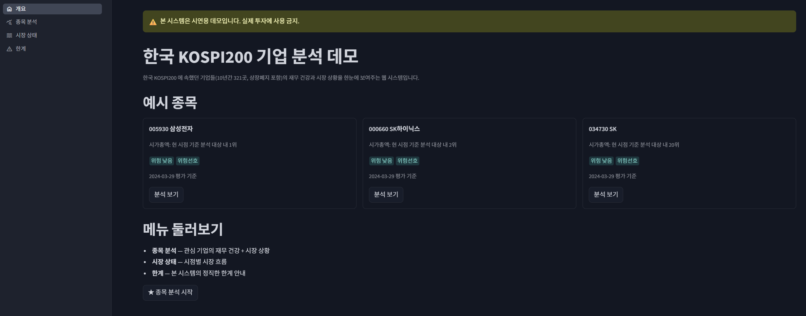
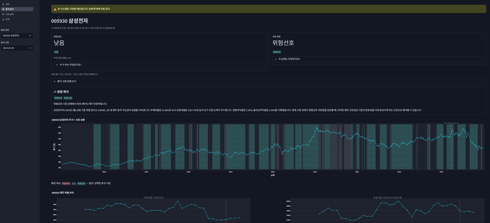
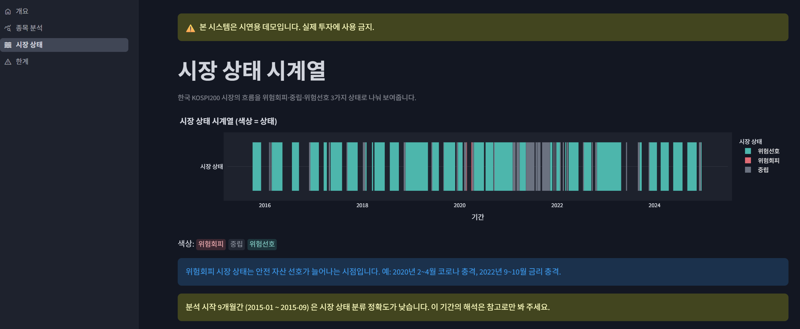

# 한국 KOSPI200 기업 분석 데모

한국 KOSPI200 에 속했던 대형주(10년간 321곳, 상장폐지 포함)의 재무 상태와
시장 분위기를 한눈에 보여주는 도구입니다. 종목 하나를 고르면 재무 건강 +
시장 상황 + 종합 해석을 함께 표시합니다. 모델의 한계도 솔직히 함께
보여주는 시연용 데모입니다.

> ⚠️ **본 시스템은 시연용 데모입니다. 실제 투자에 사용하지 않습니다.**



---

## 무엇을 보여주나요?

1. **종목별 분석** — 관심 회사 (예: 삼성전자) 의 재무 건강 + 시장 상황 +
   종합 해석
2. **시장 상황** — 한국 시장의 시점별 분위기 (위험회피 / 중립 / 위험선호)
3. **한계 안내** — 모델의 솔직한 한계와 데모임을 명시

어두운 금융 리포트 톤의 화면에서 차트와 카드로 정리해 보여줍니다.





---

## 어떻게 만들었나요?

Claude 와 함께 만든 프로젝트입니다.

- 분석 기간(2015–2024년) 중 KOSPI200 에 속했던 기업 321곳의 재무제표·주가 데이터 사용
- 머신러닝 모델로 위험 점수와 시장 상황 분류
- 언어 모델(LLM)은 *이미 검증된 수치를 시장 상태에 맞춰 풀어 쓰는 서술
  보조*로만 사용합니다 — 수치를 결정하지 않습니다. 해석 문장은 빌드
  타임에 1회 생성해 고정하며, 웹 페이지 실행 중에는 호출하지 않습니다.
  현재 시가총액 상위 40 종목에 생성돼 있고, 나머지 종목은 기본 틀
  문장으로 표시됩니다.
- 웹 페이지 (Streamlit) 로 결과 표시

자세한 기술 자료는 [`docs/`](docs/) + [`reports/`](reports/) 폴더 별도
참조.

---

## 실행 방법

```bash
# 환경 설정
uv sync --frozen

# API 키
cp .env.example .env
# DART_API_KEY=... 채우기

# 데이터 수집
uv run python scripts/collect_data.py

# 모델 학습
uv run python scripts/train_d2_baseline.py
uv run python scripts/train_regime.py

# (선택) 해석 문장 생성 — GEMINI_API_KEY 를 .env 에 추가 후 실행.
# 건너뛰어도 동작합니다 (해당 종목은 기본 틀 문장으로 표시).
uv run python scripts/generate_interpretations.py --scope latest --order marcap --limit 40

# 웹 페이지 실행
uv run streamlit run app/main.py
```

---

## 사용 환경

- Python 3.13
- 한국어 웹 페이지
- 데스크톱 브라우저 권장

---

## 라이선스

[MIT](LICENSE)

---

🤖 Claude 와 함께 만든 프로젝트입니다 (진행 중).
